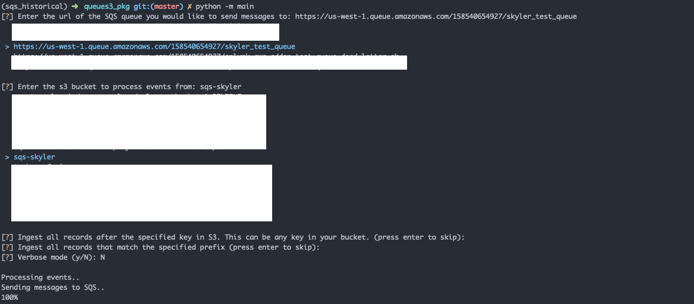

# Historical SQS based S3 ingestion for Splunk
AWS S3 can be configured to submit a message to SQS whenever an object is added to a bucket.  Splunk uses SQS to intelligently ingest new files from sources such as S3 without having to query S3 directly. This saves precious CPU cycles since Splunk no longer has to maintain a list of ingested files so that there are no duplicates. The downside to this method is that in order for a message about an object in S3 to be automatically added to SQS, it has to be added to the bucket.  While new items added to the bucket will automatically be ingested since messages are created on object upload, historical assets will not be ingested since SQS was configured after the items were added to the bucket.

This command line tool fixes this problem by crawling an AWS bucket you specify and adding events to SQS so Splunk can properly ingest them.

## Getting Started
### Requirements
1. git
2. AWS CLI (config and credentials)
3. pip

### Installation

- Clone from Github:
   - git clone https://github.com/splunk/historical-s3-sqs-python.git
   - pip install -r requirements.txt

- Install from pip:
    - tbd

### Usage
python main.py

### Tests
TBD

## Example(s)

## Contributing
TBD

## License